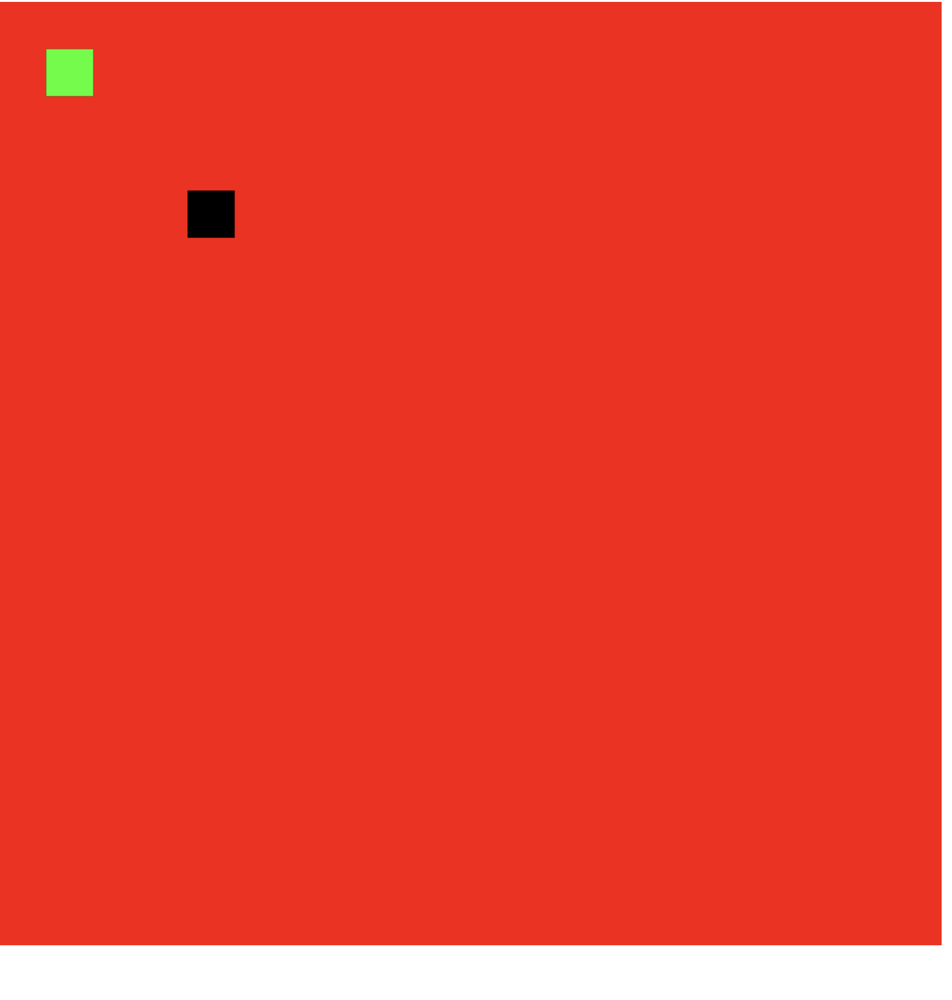

# Leaf-js

3d / 2d rendering pipeline, for developers that want performent rendering on the web.

## Example usage

1. React

Problem: Issues currently you require acccess to some type of Module to be able to run the code inside of c++

Solution: Have a provider wrapper / runtime, that can have event loop based on the module the user wants to call at any given time. This provider will wrap the main app, and allows users to call functions that exist only in C++.

> Note: Current Usage
```typescript
// In it's current form the way you would use it is as follows.
import LeafModule from 'leaf-js'; 
import { useEffect, useRef } from 'react';

const Canvas = () => {
  useEffect(() => {
    LeafModule.then((ModuleInstance) => {
      // This is where it depends on what you want to use.
      var Test = new ModuleInstance["Rectangle"](10, 10, 10, 10, true);

      Test.render();
    }); 
  });

  return (
    <div>
      <canvas id="canvas"></canvas>
    </div>
  )
};
```

<details><summary>Here is the way I would like it to work.</summary>

The Main Goal is to improve the user expierence of something like Three.js, or reactFiber. At the same time the goal is to improve proformance, and make sure the developer can have the best possible expierence with complex or simple 3d renders.

```typescript
import Leaf from 'leaf-js';

// All of these options have defaults.
const CubeRender = () => {
  return (
    {Leaf.Cube({ // Return a cube inside a canvas, that you can append to.
      x: 100, 
      y: 100,
      w: 100,
      h: 100,
      animation: {
        rotation: {
          x: { -32, 1s }
        }
      },
      color: {
        r: 0,
        g: 0,
        b: 0,
        a: 0,
      }
    })}
  )
};
```

```typescript
import Leaf, {Provider} from 'leaf-js';

const ParentCube = () => {
  return (
    <Provider
      server=?
      address=?
      returnType=?
    >
      /* The provider controls mutliple people controlling cubes at the same time, say multiplayer. */
    </Provider>
  )
}
```

</details> 

The insteresting part of this all, is currently the only process of WebGL is the smooshing if you will into the canvas. Nothing is being translated when it comes to events, rendering, state, etc. So I can render text, cursors, basically anything with any API from c++ directly, and not have to worry about browser support as long as the 'GPU' can handle the load that I am giving it. 

Once we get into a space where `<canvas>` cannot immediatly process the data say with shaders and Webgl then will we start to see the performance drops we are used to seeing in larger scale applications. The way to fix this is by directly translating Vulkan->Webgl in a completly custom matter. Not allowing compilers to ruin / bloat what we are trying to implement.

> Note: The statement above does not apply to anything 2d related until you get to the relm of having things on top of each other.

### Folder Structure

-- Include: The c++ library itself called include beacuse it is included into react as a dependency.

-- SRC: Typescript source for any provider actions / translating to typescript.

## Current State

> Note: Update to gif to show the selecting and resizing of objects inside the 'Scene'.

